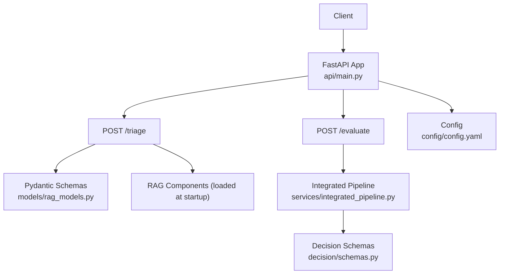
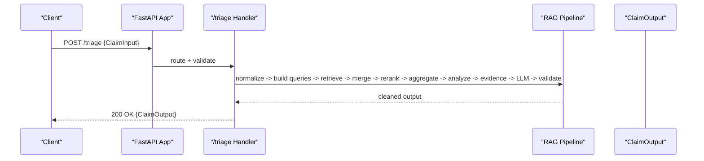
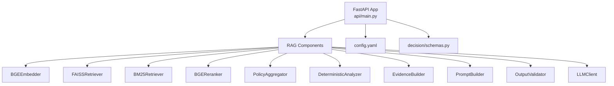
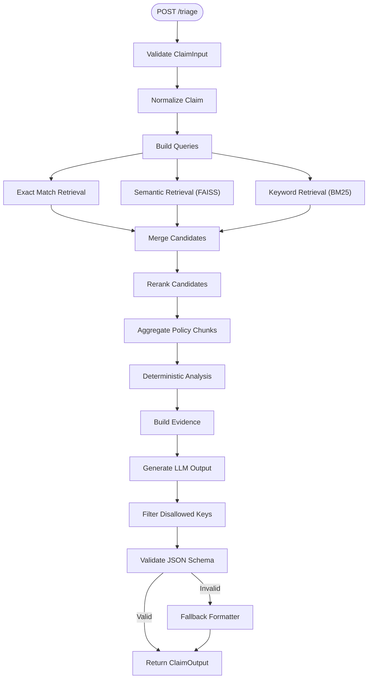
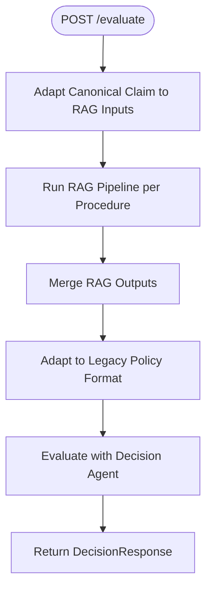

# API Reference

<cite>
**Referenced Files in This Document**
- [main.py](file://api/main.py)
- [rag_models.py](file://models/rag_models.py)
- [schemas.py](file://decision/schemas.py)
- [integrated_pipeline.py](file://services/integrated_pipeline.py)
- [config.yaml](file://config/config.yaml)
- [test_api.py](file://tests/test_api.py)
- [test_claim_aetna_knee.json](file://data/test_claim_aetna_knee.json)
</cite>

## Table of Contents
1. [Introduction](#introduction)
2. [Project Structure](#project-structure)
3. [Core Components](#core-components)
4. [Architecture Overview](#architecture-overview)
5. [Detailed Component Analysis](#detailed-component-analysis)
6. [Dependency Analysis](#dependency-analysis)
7. [Performance Considerations](#performance-considerations)
8. [Troubleshooting Guide](#troubleshooting-guide)
9. [Conclusion](#conclusion)
10. [Appendices](#appendices)

## Introduction
This document provides comprehensive API reference documentation for the CTS REST API endpoints that support policy retrieval and end-to-end integrated evaluation workflows. It covers:
- The /triage endpoint for structured policy retrieval and criteria extraction from a normalized claim input.
- The /evaluate endpoint for running an end-to-end integrated pipeline that combines RAG-based policy matching, decision logic, and optional recovery flows.

The API is implemented with FastAPI and uses Pydantic models for request/response validation. It exposes two primary POST endpoints:
- POST /triage: Returns matched policies, extracted criteria, and documentation requirements for a given claim.
- POST /evaluate: Executes the full integrated pipeline and returns a decision response including outcome, reasoning, evaluations, and evidence status.

## Project Structure
The API surface is defined in the application entry point, while data contracts are modeled using Pydantic schemas. End-to-end orchestration is encapsulated in a service module that coordinates retrieval, reranking, aggregation, analysis, LLM generation, and validation. Configuration for models and paths is loaded at startup.

**Diagram sources**
- [main.py:112-258](file://api/main.py#L112-L258)
- [rag_models.py:23-86](file://models/rag_models.py#L23-L86)
- [integrated_pipeline.py:13-253](file://services/integrated_pipeline.py#L13-L253)
- [schemas.py:171-187](file://decision/schemas.py#L171-L187)
- [config.yaml:1-14](file://config/config.yaml#L1-L14)

**Section sources**
- [main.py:112-258](file://api/main.py#L112-L258)
- [config.yaml:1-14](file://config/config.yaml#L1-L14)

## Core Components
- Request/Response Models:
  - ClaimInput and ClaimOutput define the contract for the /triage endpoint.
  - DecisionResponse defines the contract for the /evaluate endpoint.
- Integrated Pipeline:
  - Coordinates normalization, query building, three-way retrieval (exact, semantic, BM25), candidate merging, reranking, policy aggregation, deterministic analysis, evidence building, LLM generation, and output validation.
- Configuration:
  - Embedding and reranker model names, device, vector store paths, and pool sizes are loaded at startup to initialize components.

**Section sources**
- [rag_models.py:23-86](file://models/rag_models.py#L23-L86)
- [schemas.py:171-187](file://decision/schemas.py#L171-L187)
- [integrated_pipeline.py:13-253](file://services/integrated_pipeline.py#L13-L253)
- [config.yaml:1-14](file://config/config.yaml#L1-L14)

## Architecture Overview
The API initializes heavy components (embedders, retrievers, rerankers, aggregators, validators, LLM clients) once at startup and reuses them across requests. The /triage endpoint runs a focused RAG pipeline to extract criteria and documentation requirements. The /evaluate endpoint runs the full integrated flow, producing a decision outcome with detailed evaluations and reasoning.

**Diagram sources**
- [main.py:119-222](file://api/main.py#L119-L222)
- [integrated_pipeline.py:13-253](file://services/integrated_pipeline.py#L13-L253)
- [rag_models.py:23-86](file://models/rag_models.py#L23-L86)

## Detailed Component Analysis

### Endpoint: POST /triage
Purpose:
- Accepts a normalized claim input and executes a structured RAG pipeline to retrieve relevant policies and extract criteria and documentation requirements.

HTTP Method and URL:
- POST /triage

Request Schema:
- Body: ClaimInput (Pydantic model)
  - claim_id: string (required)
  - insurance.primary.payer: string (required)
  - insurance.primary.policy_id: string or null (optional)
  - diagnosis: list of DiagnosisInfo (required)
    - code: string (ICD-10)
    - description: string
  - procedure.code: string (CPT) (required)
  - procedure.description: string (required)
  - clinical_domain: string (required)

Query Parameters:
- debug: boolean (default false). When true or when DEBUG environment variable is set to true, additional debug logs are printed server-side.

Response Schema:
- 200 OK: ClaimOutput (Pydantic model)
  - claim_id: string
  - policy_matches: list of PolicyMatch
    - policy_id: string
    - payer: string
    - relevance_score: float
  - criteria: list of Criterion
    - criterion_id: string
    - criterion: string
    - policy_requirement: string
    - source: CriterionSource
      - policy_id: string
      - section: string
  - documentation_requirements: list of DocumentationRequirement
    - requirement: string
    - source: string

Authentication:
- Not configured in the API layer; no authentication middleware is present.

Error Handling:
- Validation errors return HTTP 422 with details from Pydantic validation.
- Internal server errors return HTTP 500 with error message.

Processing Logic:
- Normalizes input, builds queries, performs exact match, FAISS semantic retrieval, and BM25 keyword search.
- Merges candidates, reranks, aggregates policy chunks, analyzes deterministically, builds evidence, generates LLM output, filters disallowed keys, validates JSON schema, and applies fallback formatting if needed.

Rate Limiting:
- No rate limiting middleware is configured in the API layer.

Security Headers:
- No custom security headers are set in the API layer.

Example Requests and Responses:
- Example request payload for triage can be constructed using the test case structure for a pacemaker claim. See [test_api.py:11-46](file://tests/test_api.py#L11-L46) for a valid example.
- Example request payload for triage with Aetna knee arthroplasty can be derived from [test_claim_aetna_knee.json:1-21](file://data/test_claim_aetna_knee.json#L1-L21).

Expected Response:
- A 200 response containing claim_id, policy_matches, criteria, and documentation_requirements per the ClaimOutput schema.

**Section sources**
- [main.py:119-222](file://api/main.py#L119-L222)
- [rag_models.py:23-86](file://models/rag_models.py#L23-L86)
- [test_api.py:11-46](file://tests/test_api.py#L11-L46)
- [test_claim_aetna_knee.json:1-21](file://data/test_claim_aetna_knee.json#L1-L21)

### Endpoint: POST /evaluate
Purpose:
- Executes the end-to-end integrated pipeline that matches canonical claims against policies via RAG, evaluates criteria, and produces a decision response with outcome, reasoning, evaluations, and evidence status.

HTTP Method and URL:
- POST /evaluate

Request Schema:
- Body: Dict[str, Any] representing a CanonicalClaim-compatible structure.
  - The integrated pipeline expects fields such as claim_id, submission, case_data (including diagnoses, procedures, clinical_metrics), and evidence items.
  - Evidence items include fields like evidence_key, evidence_id, source, status, confidence_score, and extracted_facts.

Query Parameters:
- debug: boolean (default false). When true or when DEBUG environment variable is set to true, additional debug logs are printed server-side.

Response Schema:
- 200 OK: Dict[str, Any] serialized from DecisionResponse (Pydantic model)
  - case_id: string
  - outcome: enum (APPROVE, REJECT, REQUEST_MORE_INFORMATION, HUMAN_REVIEW)
  - reasoning: list of strings
  - exclusion_results: dict mapping exclusion_id to boolean
  - criteria_results: dict mapping criterion_id to boolean
  - criteria_evaluations: dict mapping criterion_id to CriterionEvaluation
  - evidence_status: dict mapping evidence_key to status or error
  - criterion_assessments: dict mapping criterion_id to CriterionAssessment
  - errors: list of strings
  - claim_id: string or null
  - policy_id: string or null
  - submission_attempt: integer or null

Authentication:
- Not configured in the API layer; no authentication middleware is present.

Error Handling:
- Internal server errors return HTTP 500 with error message.
- The integrated pipeline includes fail-closed behavior returning a DecisionResponse with HUMAN_REVIEW outcome on critical errors.

Processing Logic:
- Converts canonical claim to RAG inputs, runs the RAG pipeline per procedure, merges outputs, adapts to legacy policy format, and invokes the decision agent to evaluate the canonical claim.
- Includes administrative gates and sensitivity/release gates for recovery flows when applicable.

Rate Limiting:
- No rate limiting middleware is configured in the API layer.

Security Headers:
- No custom security headers are set in the API layer.

Example Requests and Responses:
- Example request payload for evaluate can be constructed using the test case structure for a pacemaker canonical claim. See [test_api.py:66-103](file://tests/test_api.py#L66-L103) for a valid example.

Expected Response:
- A 200 response containing case_id, outcome, reasoning, and other fields per the DecisionResponse schema.

**Section sources**
- [main.py:225-258](file://api/main.py#L225-L258)
- [integrated_pipeline.py:13-253](file://services/integrated_pipeline.py#L13-L253)
- [schemas.py:171-187](file://decision/schemas.py#L171-L187)
- [test_api.py:66-103](file://tests/test_api.py#L66-L103)

## Dependency Analysis
The API depends on several internal modules and external services:
- RAG components: embedder, retrievers (FAISS, BM25), reranker, candidate pool, policy aggregator, deterministic analyzer, evidence builder, prompt builder, output validator, LLM client.
- Configuration: model names, device, vector store paths, cache directories, and processed chunk files.
- Decision schemas: enums and models defining outcomes, assessments, and evaluations.

**Diagram sources**
- [main.py:44-117](file://api/main.py#L44-L117)
- [config.yaml:1-14](file://config/config.yaml#L1-L14)
- [schemas.py:171-187](file://decision/schemas.py#L171-L187)

**Section sources**
- [main.py:44-117](file://api/main.py#L44-L117)
- [config.yaml:1-14](file://config/config.yaml#L1-L14)
- [schemas.py:171-187](file://decision/schemas.py#L171-L187)

## Performance Considerations
- Startup Initialization: Heavy components (embedders, retrievers, rerankers) are loaded once at startup to reduce per-request latency.
- Candidate Pool Size: Controlled by configuration; larger pools increase recall but may increase processing time.
- Retrieval Strategy: Three-way retrieval (exact, semantic, BM25) balances precision and recall; reranking improves final selection quality.
- Fallback Formatting: If LLM output fails validation, a deterministic formatter is used to ensure consistent responses.
- Debug Mode: Enabling debug logging can impact performance; use only during development or troubleshooting.

[No sources needed since this section provides general guidance]

## Troubleshooting Guide
Common Issues:
- Validation Errors (422): Occur when request payloads do not conform to Pydantic schemas. Check required fields and types.
- Internal Server Errors (500): Indicate unexpected exceptions in the pipeline. Review server logs for stack traces.
- No Policy Matches: If RAG does not find reliable policy matches, the integrated pipeline may return HUMAN_REVIEW with explanatory reasoning.
- Rate Limits: External LLM providers may impose rate limits; monitor for 429 responses from provider calls.

Debugging Tips:
- Enable debug mode via query parameter or environment variable to print detailed pipeline steps and timing.
- Inspect returned policy_matches and criteria to verify correct policy identification and criterion extraction.
- For /evaluate, review reasoning and criteria_evaluations to understand why a particular outcome was reached.

Integration Patterns:
- Retry with Backoff: Implement exponential backoff for transient failures (e.g., network timeouts, rate limits).
- Circuit Breaker: Protect against cascading failures when downstream services are degraded.
- Observability: Correlate requests with correlation IDs and log key pipeline stages for traceability.

**Section sources**
- [main.py:219-222](file://api/main.py#L219-L222)
- [main.py:257-258](file://api/main.py#L257-L258)
- [integrated_pipeline.py:114-117](file://services/integrated_pipeline.py#L114-L117)
- [integrated_pipeline.py:240-253](file://services/integrated_pipeline.py#L240-L253)

## Conclusion
The CTS REST API provides two powerful endpoints:
- /triage for efficient policy retrieval and criteria extraction from normalized claims.
- /evaluate for end-to-end integrated evaluation producing actionable decisions with rich reasoning and evidence status.

Clients should adhere to the documented request/response schemas, handle validation and server errors appropriately, and consider operational aspects such as rate limiting, retries, and observability when integrating with the API.

[No sources needed since this section summarizes without analyzing specific files]

## Appendices

### Appendix A: Data Flow for /triage

**Diagram sources**
- [main.py:119-222](file://api/main.py#L119-L222)

### Appendix B: Data Flow for /evaluate

**Diagram sources**
- [integrated_pipeline.py:13-253](file://services/integrated_pipeline.py#L13-L253)