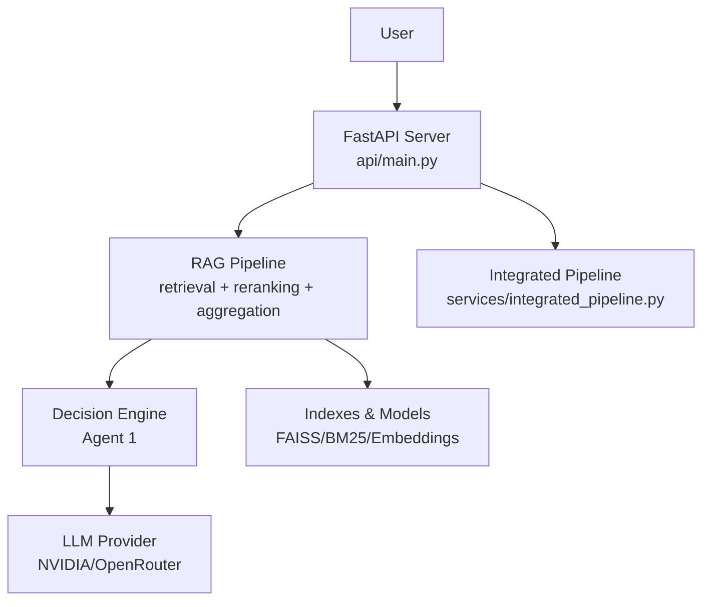
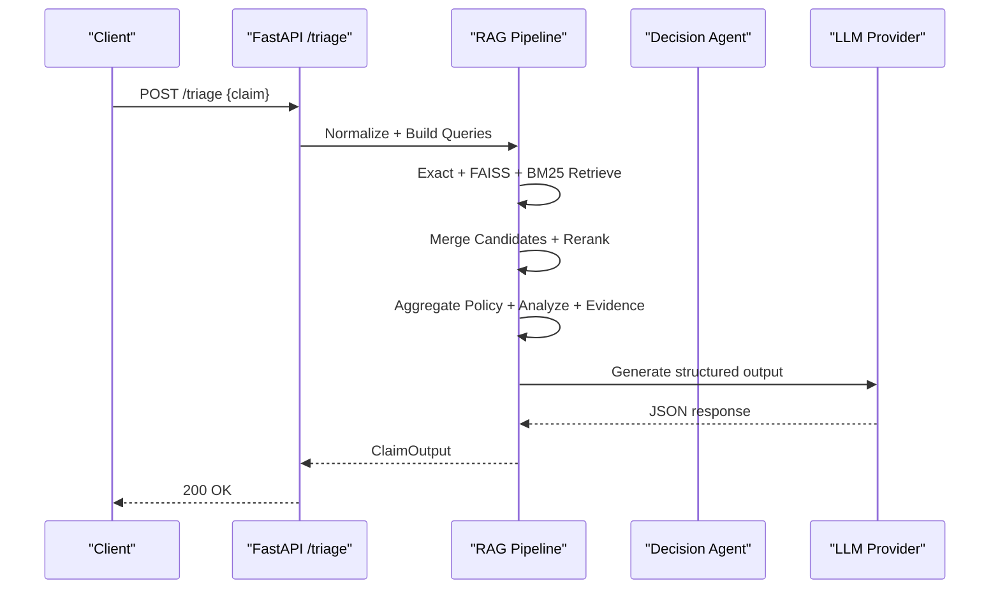
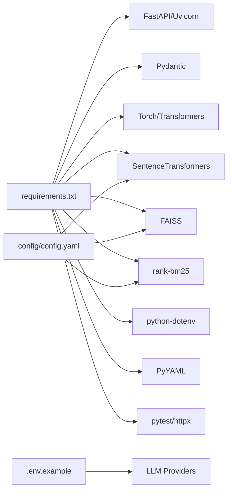

# Getting Started Guide

<cite>
**Referenced Files in This Document**
- [README.md](file://README.md)
- [requirements.txt](file://requirements.txt)
- [config/config.yaml](file://config/config.yaml)
- [.env.example](file://.env.example)
- [api/main.py](file://api/main.py)
- [scripts/build_index.py](file://scripts/build_index.py)
- [scripts/query_pipeline.py](file://scripts/query_pipeline.py)
- [services/integrated_pipeline.py](file://services/integrated_pipeline.py)
- [data/test_claim_aetna_knee.json](file://data/test_claim_aetna_knee.json)
- [tests/test_api.py](file://tests/test_api.py)
- [decision/llm_provider.py](file://decision/llm_provider.py)
</cite>

## Table of Contents
1. [Introduction](#introduction)
2. [Project Structure](#project-structure)
3. [Core Components](#core-components)
4. [Architecture Overview](#architecture-overview)
5. [Detailed Component Analysis](#detailed-component-analysis)
6. [Dependency Analysis](#dependency-analysis)
7. [Performance Considerations](#performance-considerations)
8. [Troubleshooting Guide](#troubleshooting-guide)
9. [Conclusion](#conclusion)
10. [Appendices](#appendices)

## Introduction
This guide helps you set up and run the CTS system from scratch. You will install dependencies, configure environment variables (including NVIDIA API), build search indexes, run tests, start the FastAPI server, and execute your first API call. It also includes step-by-step examples for processing a sample claim file and running the integrated query pipeline.

## Project Structure
The repository is organized into clear layers:
- Configuration and data assets under config/ and data/
- RAG retrieval and analysis components under rag/
- Decision engine and schemas under decision/
- API endpoints under api/
- Scripts for indexing, querying, evaluation, and benchmarking under scripts/
- Tests under tests/

**Diagram sources**
- [api/main.py:44-117](file://api/main.py#L44-L117)
- [services/integrated_pipeline.py:13-237](file://services/integrated_pipeline.py#L13-L237)
- [decision/llm_provider.py:58-161](file://decision/llm_provider.py#L58-L161)

**Section sources**
- [README.md:7-52](file://README.md#L7-L52)

## Core Components
- FastAPI application with lifespan initialization that loads configuration, chunks, and builds retrievers and models once per process.
- Three-way retrieval: exact matching, FAISS semantic search, and BM25 keyword search, merged via a candidate pool and reranked.
- Policy aggregator enforces single-policy consistency before deterministic analysis and evidence building.
- LLM client formats structured outputs using configured providers (NVIDIA or OpenRouter).
- Integrated pipeline orchestrates end-to-end flows from canonical claims to decisions.

Key responsibilities:
- Indexing: normalize policies, chunk documents, generate embeddings, build FAISS and BM25 indexes.
- Querying: normalize input, build queries, retrieve, rerank, aggregate, analyze, build evidence, format output.
- API: expose /triage and /evaluate endpoints with validation and error handling.

**Section sources**
- [api/main.py:44-117](file://api/main.py#L44-L117)
- [api/main.py:119-222](file://api/main.py#L119-L222)
- [scripts/build_index.py:11-92](file://scripts/build_index.py#L11-L92)
- [services/integrated_pipeline.py:13-237](file://services/integrated_pipeline.py#L13-L237)

## Architecture Overview
The system follows a layered architecture:
- API layer exposes REST endpoints and delegates to services.
- Services orchestrate RAG retrieval and decision logic.
- RAG layer performs multi-modal retrieval and policy selection.
- Decision layer evaluates criteria deterministically and uses LLMs only for structured formatting.
- Providers connect to external LLM APIs (NVIDIA/OpenRouter).

**Diagram sources**
- [api/main.py:119-222](file://api/main.py#L119-L222)
- [services/integrated_pipeline.py:13-237](file://services/integrated_pipeline.py#L13-L237)
- [decision/llm_provider.py:58-161](file://decision/llm_provider.py#L58-L161)

## Detailed Component Analysis

### Installation and Environment Setup
- Python version: 3.12+
- Install dependencies from requirements.txt
- Configure environment variables for LLM providers and cache paths
- Ensure required data files exist before starting the server

Steps:
1. Create a virtual environment and activate it.
2. Install dependencies: pip install -r requirements.txt
3. Copy .env.example to .env and fill in keys and URLs.
4. Set model cache directories if needed (e.g., HF_HOME, TRANSFORMERS_CACHE, etc.).
5. Verify environment variables are loaded by the application at startup.

Notes:
- The API reads config.yaml for embedding/reranker models and paths.
- Processed chunks must be built before starting the server; otherwise, the lifespan raises an error.

**Section sources**
- [requirements.txt:1-15](file://requirements.txt#L1-L15)
- [.env.example:1-21](file://.env.example#L1-L21)
- [config/config.yaml:1-14](file://config/config.yaml#L1-L14)
- [api/main.py:53-65](file://api/main.py#L53-L65)

### Building Search Indexes
Builds normalizations, chunks policies, generates embeddings, and constructs FAISS and BM25 indexes.

Run:
- python -m scripts.build_index

What happens:
- Normalizes raw policy dataset to normalized JSON.
- Chunks normalized policies into searchable units.
- Generates embeddings for each chunk representation.
- Builds FAISS vector index and saves metadata mapping.
- Builds BM25 index and persists it.

Verification:
- After completion, processed_chunks.json and vector_store contents should exist.

**Section sources**
- [scripts/build_index.py:11-92](file://scripts/build_index.py#L11-L92)
- [config/config.yaml:6-14](file://config/config.yaml#L6-L14)

### Running the Test Suite
Execute the Pytest suite to validate API behavior and basic integration.

Run:
- python -m pytest -v

Highlights:
- Tests assert successful triage responses and correct structure.
- Validation error test ensures malformed inputs return 422.
- Evaluate endpoint test asserts decision response fields.

**Section sources**
- [tests/test_api.py:11-47](file://tests/test_api.py#L11-L47)
- [tests/test_api.py:66-103](file://tests/test_api.py#L66-L103)

### Starting the FastAPI Server
Launch the API server using Uvicorn.

Run:
- uvicorn api.main:app --host 127.0.0.1 --port 8000

Startup behavior:
- Loads configuration and processed chunks.
- Instantiates matchers, embedder, FAISS and BM25 retrievers, reranker, aggregators, analyzers, evidence builder, LLM client, prompt builder, validator, and query builder.
- If processed chunks are missing, startup fails with a clear error.

Endpoints:
- POST /triage: Executes the three-way RAG pipeline and returns structured ClaimOutput.
- POST /evaluate: Runs the integrated end-to-end flow on a canonical claim.

Debugging:
- Use debug query parameter or DEBUG environment variable to print detailed logs during triage.

**Section sources**
- [api/main.py:44-117](file://api/main.py#L44-L117)
- [api/main.py:119-222](file://api/main.py#L119-L222)
- [api/main.py:225-258](file://api/main.py#L225-L258)

### Executing Your First API Call
Example using the provided sample claim:

- File: data/test_claim_aetna_knee.json
- Endpoint: POST /triage
- Body: JSON payload from the sample file

Expected result:
- Status 200 with a structured response containing claim_id, policy_matches, criteria, and documentation_requirements.

Validation:
- Tests demonstrate expected structure and field presence for similar claims.

**Section sources**
- [data/test_claim_aetna_knee.json:1-21](file://data/test_claim_aetna_knee.json#L1-L21)
- [tests/test_api.py:11-47](file://tests/test_api.py#L11-L47)

### Processing a Sample Claim File via CLI
Use the integrated query pipeline script to run the full end-to-end flow on a claim file.

Run:
- python -m scripts.query_pipeline data/test_claim_aetna_knee.json

Behavior:
- Loads configuration and processes chunks.
- Initializes all RAG components.
- Converts input to canonical claim and optionally enriches payer context.
- Runs the integrated pipeline and prints the final decision response.

**Section sources**
- [scripts/query_pipeline.py:23-129](file://scripts/query_pipeline.py#L23-L129)
- [services/integrated_pipeline.py:13-237](file://services/integrated_pipeline.py#L13-L237)

### Running the Integrated Query Pipeline
The integrated pipeline coordinates:
- Canonical claim to RAG inputs
- Multi-retrieval and reranking
- Policy aggregation and deterministic analysis
- Evidence building and LLM formatting
- Optional Agent 2 recovery loop (when applicable)

It safely handles failures by returning human review outcomes when necessary.

**Section sources**
- [services/integrated_pipeline.py:13-237](file://services/integrated_pipeline.py#L13-L237)

## Dependency Analysis
External and internal dependencies:
- FastAPI and Uvicorn for the web server
- Pydantic for request/response validation
- NumPy, Pandas for data manipulation
- Torch and Transformers for model loading
- SentenceTransformers for embeddings
- FAISS for vector similarity search
- rank-bm25 for keyword retrieval
- python-dotenv for environment loading
- PyYAML for configuration parsing
- scikit-learn for ML utilities
- pytest for testing
- httpx for HTTP operations

Configuration influences:
- config.yaml sets model names, device, and paths for embeddings, vector store, and caches.
- .env provides API keys and URLs for LLM providers and cache directories.

**Diagram sources**
- [requirements.txt:1-15](file://requirements.txt#L1-L15)
- [config/config.yaml:1-14](file://config/config.yaml#L1-L14)
- [.env.example:1-21](file://.env.example#L1-L21)

**Section sources**
- [requirements.txt:1-15](file://requirements.txt#L1-L15)
- [config/config.yaml:1-14](file://config/config.yaml#L1-L14)
- [.env.example:1-21](file://.env.example#L1-L21)

## Performance Considerations
- Embedding and reranking models are loaded once at server startup; reuse them across requests.
- FAISS and BM25 indexes are persisted and loaded quickly; ensure they are built before starting the server.
- Device selection (CPU/GPU) can be tuned via config.yaml to balance speed and resource usage.
- Candidate pool size and final chunk count affect latency and accuracy; adjust based on workload.
- LLM calls have timeouts and rate limits; monitor provider responses and consider retries or backoff in custom integrations.

[No sources needed since this section provides general guidance]

## Troubleshooting Guide
Common issues and resolutions:

- Missing processed chunks at startup:
  - Symptom: Startup error indicating processed chunks not found.
  - Resolution: Run the index builder script to create processed_chunks.json and vector stores.

- NVIDIA API key missing or invalid:
  - Symptom: Errors about missing or unauthorized NVIDIA API access.
  - Resolution: Set NVIDIA_API_KEY and optionally NVIDIA_MODEL and NVIDIA_API_URL in .env.

- Rate limit or network errors from LLM provider:
  - Symptom: HTTP 429 or network timeout errors.
  - Resolution: Check provider quotas, network connectivity, and retry with backoff.

- Invalid or malformed claim input:
  - Symptom: 422 validation error on POST /triage.
  - Resolution: Ensure required fields like procedure code and clinical domain are present.

- Cache directory permissions:
  - Symptom: Failures writing to cache paths.
  - Resolution: Set HF_HOME, TRANSFORMERS_CACHE, TORCH_HOME to writable directories.

- Debugging API calls:
  - Use debug query parameter or set DEBUG=true to print detailed logs during triage.

- Verifying environment variables:
  - Confirm keys and URLs are loaded by checking provider initialization and any verification scripts.

**Section sources**
- [api/main.py:53-65](file://api/main.py#L53-L65)
- [api/main.py:192-222](file://api/main.py#L192-L222)
- [decision/llm_provider.py:58-161](file://decision/llm_provider.py#L58-L161)
- [.env.example:1-21](file://.env.example#L1-L21)

## Conclusion
You now have the steps to install, configure, build indexes, run tests, start the API server, and execute your first API call. Use the CLI query pipeline for end-to-end processing and leverage the integrated pipeline for advanced workflows. Follow troubleshooting guidance to resolve common setup issues and verify your environment.

[No sources needed since this section summarizes without analyzing specific files]

## Appendices

### Quick Start Checklist
- Python 3.12+ installed
- Virtual environment created and activated
- Dependencies installed from requirements.txt
- .env configured with NVIDIA and/or OpenRouter keys and URLs
- Indexes built via scripts.build_index
- Tests pass via pytest
- Server started with uvicorn
- First API call executed against /triage

**Section sources**
- [README.md:88-149](file://README.md#L88-L149)
- [requirements.txt:1-15](file://requirements.txt#L1-L15)
- [scripts/build_index.py:11-92](file://scripts/build_index.py#L11-L92)
- [api/main.py:119-222](file://api/main.py#L119-L222)