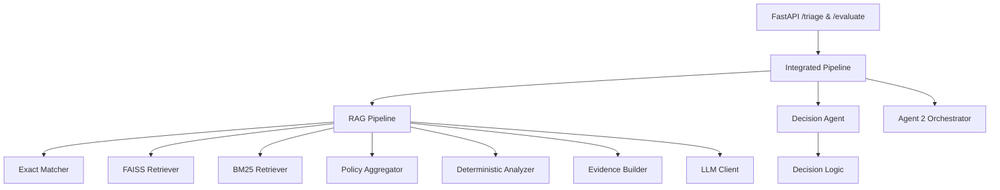
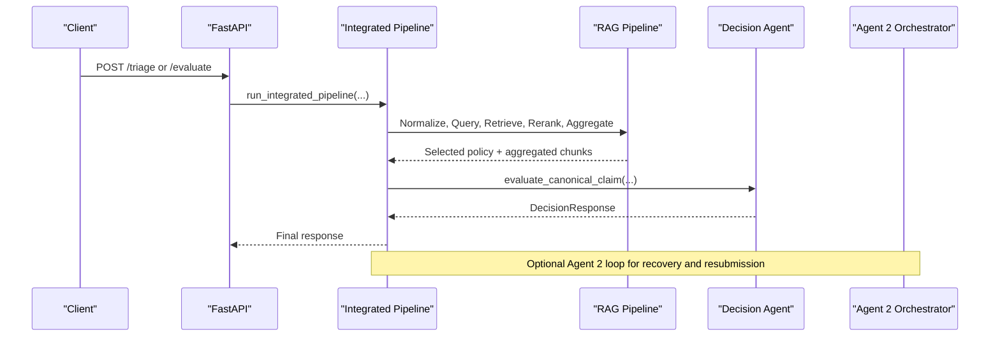
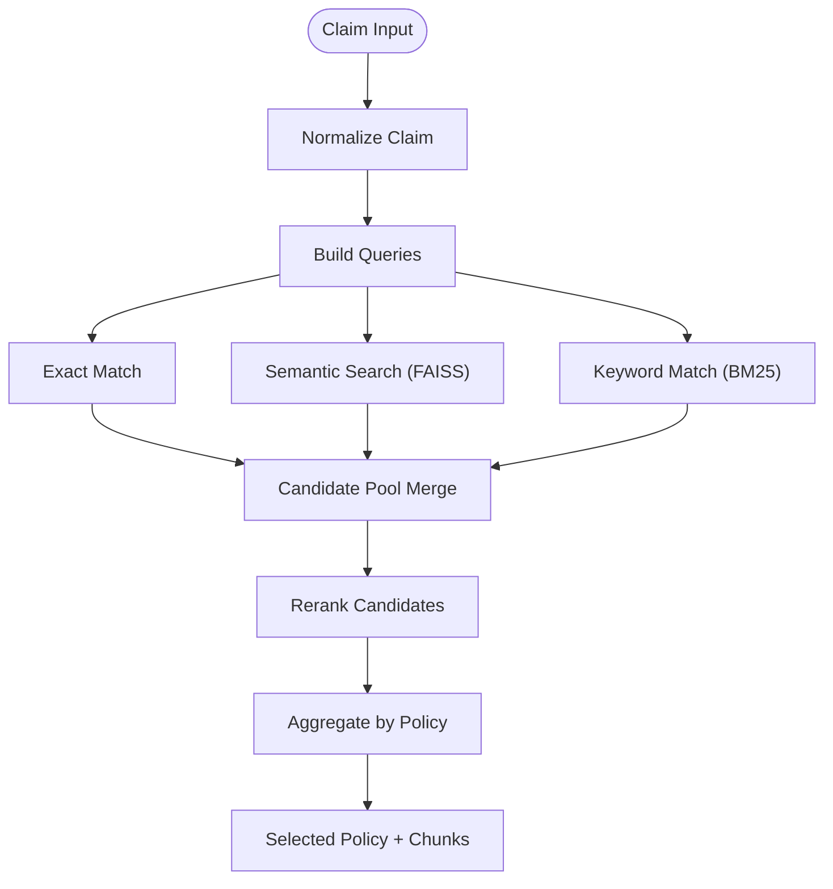
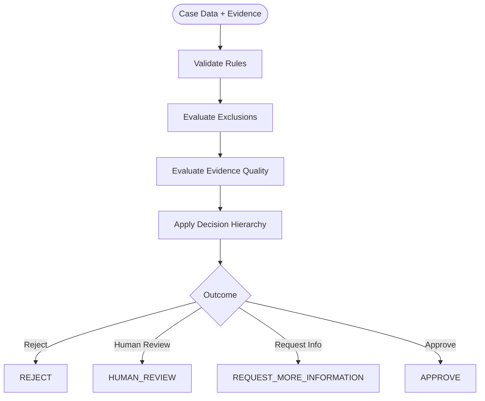
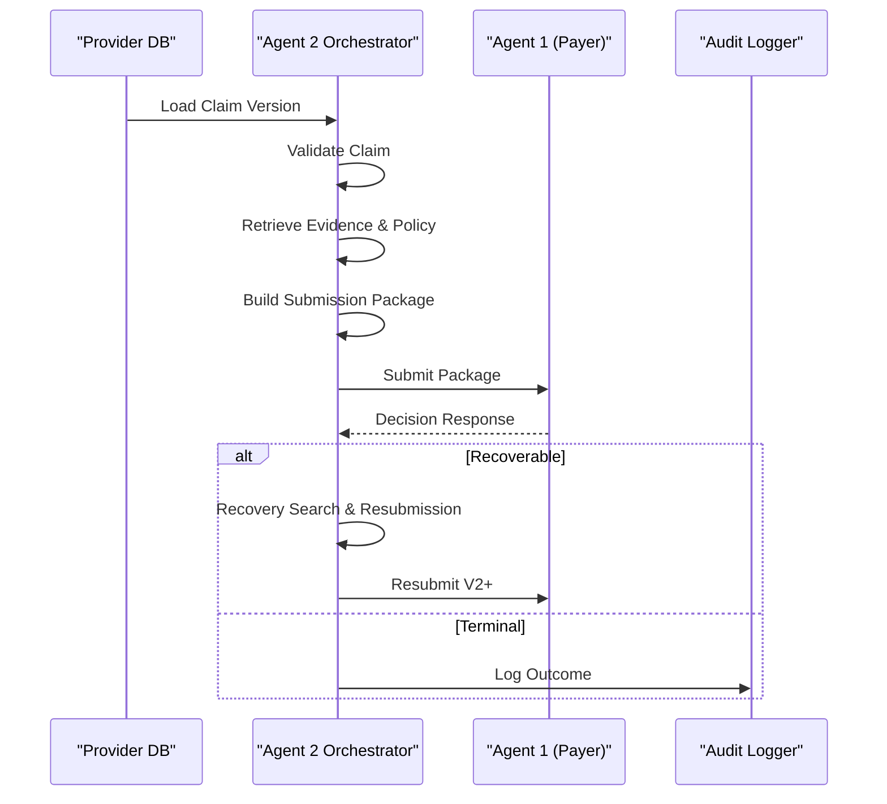
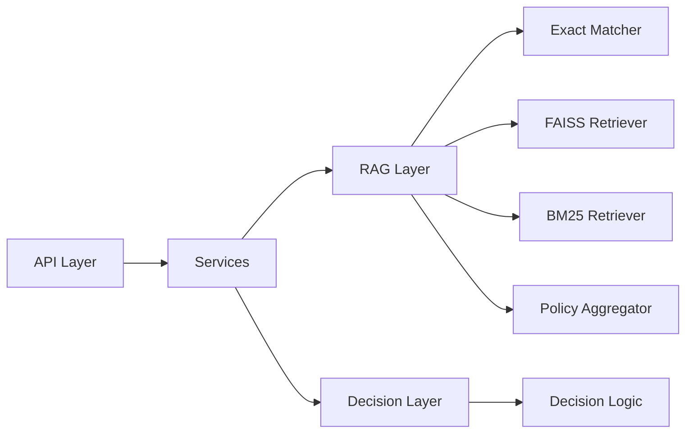

# Project Overview

<cite>
**Referenced Files in This Document**
- [README.md](file://README.md)
- [agent2/README.md](file://agent2/README.md)
- [config/config.yaml](file://config/config.yaml)
- [api/main.py](file://api/main.py)
- [services/integrated_pipeline.py](file://services/integrated_pipeline.py)
- [decision/agent.py](file://decision/agent.py)
- [decision/decision_logic.py](file://decision/decision_logic.py)
- [rag/retrieval/exact_matcher.py](file://rag/retrieval/exact_matcher.py)
- [rag/retrieval/faiss_retriever.py](file://rag/retrieval/faiss_retriever.py)
- [rag/retrieval/bm25_retriever.py](file://rag/retrieval/bm25_retriever.py)
- [rag/aggregation/policy_aggregator.py](file://rag/aggregation/policy_aggregator.py)
- [models/rag_models.py](file://models/rag_models.py)
- [data/test_claim_aetna_knee.json](file://data/test_claim_aetna_knee.json)
</cite>

## Table of Contents
1. [Introduction](#introduction)
2. [Project Structure](#project-structure)
3. [Core Components](#core-components)
4. [Architecture Overview](#architecture-overview)
5. [Detailed Component Analysis](#detailed-component-analysis)
6. [Dependency Analysis](#dependency-analysis)
7. [Performance Considerations](#performance-considerations)
8. [Troubleshooting Guide](#troubleshooting-guide)
9. [Conclusion](#conclusion)
10. [Appendices](#appendices)

## Introduction
This document provides a comprehensive overview of the CTS Prior Authorization system, a healthcare policy retrieval and clinical decision engine designed to automate medical insurance prior authorization processing. The system combines a Retrieval-Augmented Generation (RAG) pipeline with deterministic decision-making and agent-based workflows to deliver compliant, auditable outcomes for payers and providers.

Key capabilities include:
- Three-way retrieval: exact code matching, semantic search via embeddings, and keyword matching via BM25.
- Deterministic clinical decision making that enforces strict safety and fail-closed behavior.
- Agent orchestration across provider-side (Agent 2) and payer-side (Agent 1) components, including closed-loop resubmissions and trust boundary enforcement.
- Integration patterns suitable for claim triage, policy matching, and decision generation at scale.

The system is structured to support both conceptual understanding for beginners and technical depth for experienced developers implementing similar solutions.

**Section sources**
- [README.md:1-158](file://README.md#L1-L158)
- [agent2/README.md:1-155](file://agent2/README.md#L1-L155)

## Project Structure
The repository separates concerns into clear layers:
- API layer: FastAPI endpoints orchestrating the RAG pipeline and integrated evaluation.
- RAG layer: Multi-way retrieval, reranking, policy aggregation, evidence building, LLM prompting, and output validation.
- Decision layer: Deterministic clinical decision engine with rule evaluation, evidence quality checks, and hierarchy-based outcomes.
- Agent 2 layer: Provider-side orchestrator managing evidence recovery, submission packaging, and payer integration.
- Configuration and data: Model settings, indexes, and test claims.

**Diagram sources**
- [api/main.py:44-117](file://api/main.py#L44-L117)
- [services/integrated_pipeline.py:13-237](file://services/integrated_pipeline.py#L13-L237)
- [decision/agent.py:33-52](file://decision/agent.py#L33-L52)
- [decision/decision_logic.py:25-37](file://decision/decision_logic.py#L25-L37)

**Section sources**
- [README.md:7-52](file://README.md#L7-L52)
- [api/main.py:112-117](file://api/main.py#L112-L117)
- [services/integrated_pipeline.py:13-237](file://services/integrated_pipeline.py#L13-L237)

## Core Components
- Policy retrieval: Combines exact code matching, semantic vector search, and keyword matching to identify relevant policy chunks while enforcing cross-policy contamination prevention.
- Clinical decision engine: Applies deterministic rules over case data and evidence to produce APPROVE, REJECT, REQUEST_MORE_INFORMATION, or HUMAN_REVIEW outcomes.
- Agent orchestration: Coordinates provider-side evidence recovery and payer-side decision loops with auditability and compliance safeguards.
- Integration patterns: REST API endpoints for triage and evaluation; service layer for end-to-end flows; adapters for canonical claim transformation.

Practical examples:
- Claim triage: Submit a normalized claim to /triage to retrieve policies and extract criteria.
- Policy matching: Use three-way retrieval to select the best policy and aggregate its chunks.
- Decision generation: Run the integrated pipeline to evaluate against policy criteria and produce a final outcome.

**Section sources**
- [api/main.py:119-222](file://api/main.py#L119-L222)
- [services/integrated_pipeline.py:13-237](file://services/integrated_pipeline.py#L13-L237)
- [decision/decision_logic.py:25-444](file://decision/decision_logic.py#L25-L444)
- [rag/aggregation/policy_aggregator.py:7-100](file://rag/aggregation/policy_aggregator.py#L7-L100)

## Architecture Overview
The system follows a layered architecture:
- API Layer: Exposes endpoints for triage and evaluation, initializing models and indexes once at startup.
- Service Layer: Orchestrates the integrated pipeline from canonical claims through RAG and decision logic.
- RAG Layer: Executes three-way retrieval, reranking, policy aggregation, evidence assembly, and LLM formatting.
- Decision Layer: Enforces deterministic evaluation with strict hierarchy and safety gates.
- Agent 2 Layer: Manages provider-side workflows, evidence recovery, submission packaging, and payer interactions.

**Diagram sources**
- [api/main.py:119-222](file://api/main.py#L119-L222)
- [services/integrated_pipeline.py:13-237](file://services/integrated_pipeline.py#L13-L237)
- [decision/agent.py:474-716](file://decision/agent.py#L474-L716)

## Detailed Component Analysis

### Three-Way Retrieval Pipeline
The retrieval pipeline merges results from:
- Exact matcher: Scores based on payer, policy ID, clinical domain, procedure codes, and diagnosis codes with range support.
- FAISS retriever: Semantic similarity using BGE embeddings and inner product scoring.
- BM25 retriever: Keyword matching over tokenized text fields.

Results are merged into a candidate pool, reranked, and aggregated to a single policy with strict consistency gating.

**Diagram sources**
- [api/main.py:128-164](file://api/main.py#L128-L164)
- [rag/retrieval/exact_matcher.py:37-120](file://rag/retrieval/exact_matcher.py#L37-L120)
- [rag/retrieval/faiss_retriever.py:69-94](file://rag/retrieval/faiss_retriever.py#L69-L94)
- [rag/retrieval/bm25_retriever.py:73-111](file://rag/retrieval/bm25_retriever.py#L73-L111)
- [rag/aggregation/policy_aggregator.py:7-100](file://rag/aggregation/policy_aggregator.py#L7-L100)

**Section sources**
- [rag/retrieval/exact_matcher.py:1-177](file://rag/retrieval/exact_matcher.py#L1-L177)
- [rag/retrieval/faiss_retriever.py:1-95](file://rag/retrieval/faiss_retriever.py#L1-L95)
- [rag/retrieval/bm25_retriever.py:1-112](file://rag/retrieval/bm25_retriever.py#L1-L112)
- [rag/aggregation/policy_aggregator.py:1-161](file://rag/aggregation/policy_aggregator.py#L1-L161)

### Deterministic Clinical Decision Engine
The decision engine evaluates exclusions first, then applies criterion evaluations with evidence quality checks, following a strict hierarchy:
- EXCLUSION → CONFLICT → FAILED → MISSING → APPROVE
- Safety gates enforce fail-closed behavior for unknown payers, invalid rules, or unexpected states.

**Diagram sources**
- [decision/decision_logic.py:25-444](file://decision/decision_logic.py#L25-L444)

**Section sources**
- [decision/decision_logic.py:1-444](file://decision/decision_logic.py#L1-L444)
- [decision/agent.py:33-716](file://decision/agent.py#L33-L716)

### Agent Orchestration (Provider-Side)
Agent 2 manages the full lifecycle of a claim:
- Intake validation and evidence retrieval
- Policy retrieval and criterion mapping
- Submission package construction with trust boundary filtering
- Payer interaction and closed-loop resubmissions when recoverable
- Audit logging and human review escalation

**Diagram sources**
- [agent2/workflow/orchestrator.py:38-554](file://agent2/workflow/orchestrator.py#L38-L554)

**Section sources**
- [agent2/workflow/orchestrator.py:1-554](file://agent2/workflow/orchestrator.py#L1-L554)
- [agent2/README.md:1-155](file://agent2/README.md#L1-L155)

### API Endpoints and Integration Patterns
- /triage: Executes the three-way RAG pipeline and returns structured policy matches and criteria.
- /evaluate: Runs the integrated pipeline from canonical claims through RAG and decision logic, returning a DecisionResponse.

Integration points:
- Adapters transform between canonical claims and legacy formats.
- Services encapsulate the end-to-end flow with error handling and fallbacks.
- Configuration centralizes model and index paths.

**Section sources**
- [api/main.py:119-258](file://api/main.py#L119-L258)
- [services/integrated_pipeline.py:13-237](file://services/integrated_pipeline.py#L13-L237)
- [config/config.yaml:1-14](file://config/config.yaml#L1-L14)

## Dependency Analysis
The system exhibits clear separation of concerns:
- API depends on services and RAG components.
- Services depend on adapters, RAG, and decision modules.
- Decision module depends on schemas and evaluators.
- RAG components are modular and reusable across pipelines.

**Diagram sources**
- [api/main.py:10-24](file://api/main.py#L10-L24)
- [services/integrated_pipeline.py:6-11](file://services/integrated_pipeline.py#L6-L11)
- [decision/decision_logic.py:1-23](file://decision/decision_logic.py#L1-L23)

**Section sources**
- [api/main.py:10-24](file://api/main.py#L10-L24)
- [services/integrated_pipeline.py:6-11](file://services/integrated_pipeline.py#L6-L11)

## Performance Considerations
- Indexing: Build FAISS and BM25 indexes once to avoid repeated computation.
- Candidate pooling: Limit top-k candidates to balance recall and latency.
- Reranking: Use lightweight reranker to refine results without heavy overhead.
- Fail-closed design: Ensures safe defaults under failure conditions, minimizing risk but potentially increasing human review volume.
- Concurrency: API lifespan initializes shared resources once for efficient request handling.

[No sources needed since this section provides general guidance]

## Troubleshooting Guide
Common issues and resolutions:
- Missing processed chunks: Ensure index builder script has been run before starting the API.
- Validation errors: Check input schema compliance for claims.
- No policy match: Verify procedure codes and payer alignment; check requested_policy_id constraints.
- LLM output validation failures: System falls back to deterministic formatter to guarantee valid output.
- Agent 2 recovery blocked: Administrative gates (eligibility, filing deadlines) may prevent resubmission.

**Section sources**
- [api/main.py:58-65](file://api/main.py#L58-L65)
- [api/main.py:188-204](file://api/main.py#L188-L204)
- [services/integrated_pipeline.py:193-205](file://services/integrated_pipeline.py#L193-L205)
- [services/integrated_pipeline.py:355-372](file://services/integrated_pipeline.py#L355-L372)

## Conclusion
The CTS Prior Authorization system delivers a robust, compliant solution for healthcare policy retrieval and clinical decision-making. By combining three-way retrieval, deterministic evaluation, and agent-based orchestration, it supports efficient claim triage, accurate policy matching, and auditable decision generation. The modular architecture enables scalability and adaptability for diverse payer and provider environments.

[No sources needed since this section summarizes without analyzing specific files]

## Appendices

### Example Claim Payload
A sample claim demonstrates typical structure for orthopedic knee procedures.

**Section sources**
- [data/test_claim_aetna_knee.json:1-21](file://data/test_claim_aetna_knee.json#L1-L21)

### Configuration Reference
Key configuration options include embedding and reranker models, device settings, and file paths for indexes and data.

**Section sources**
- [config/config.yaml:1-14](file://config/config.yaml#L1-L14)