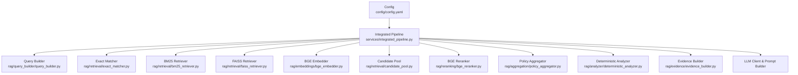
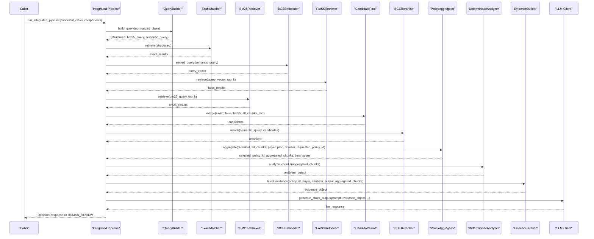
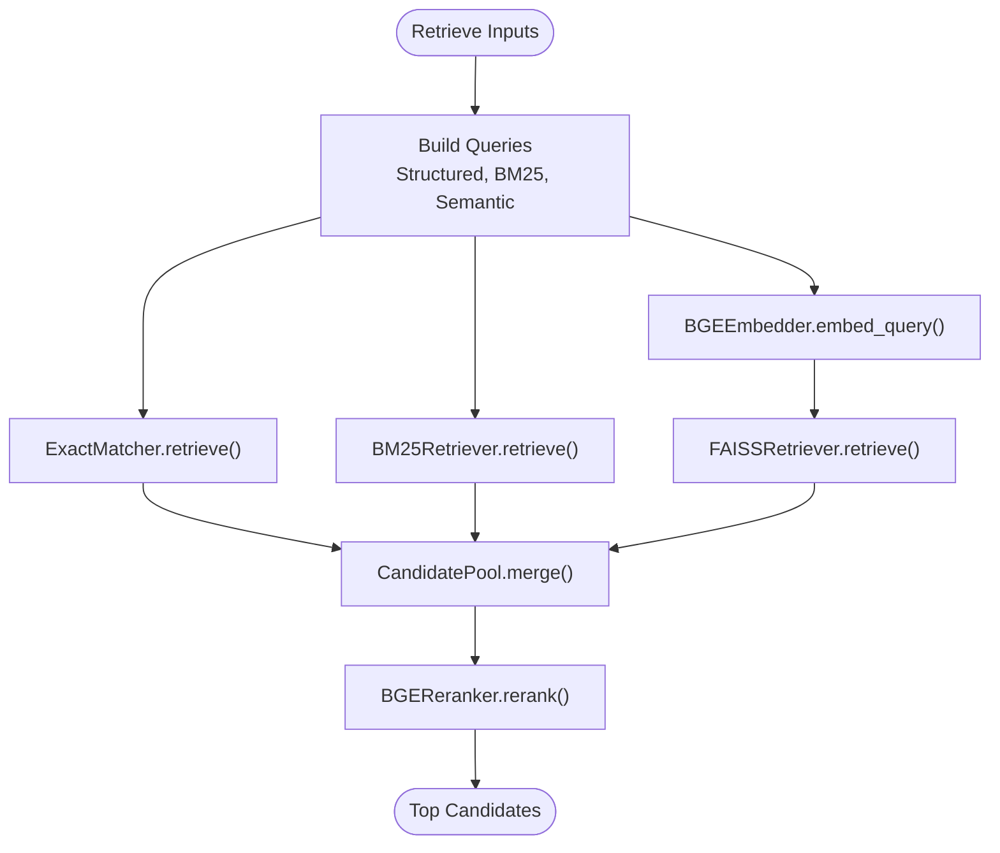
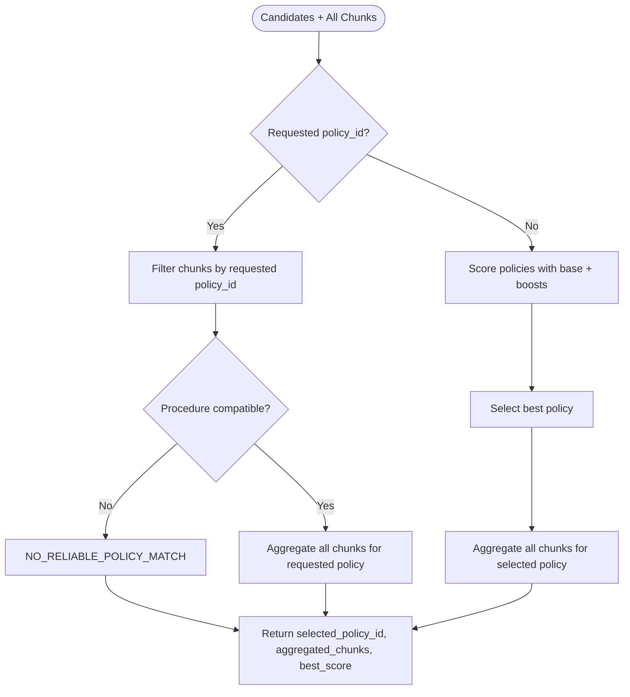
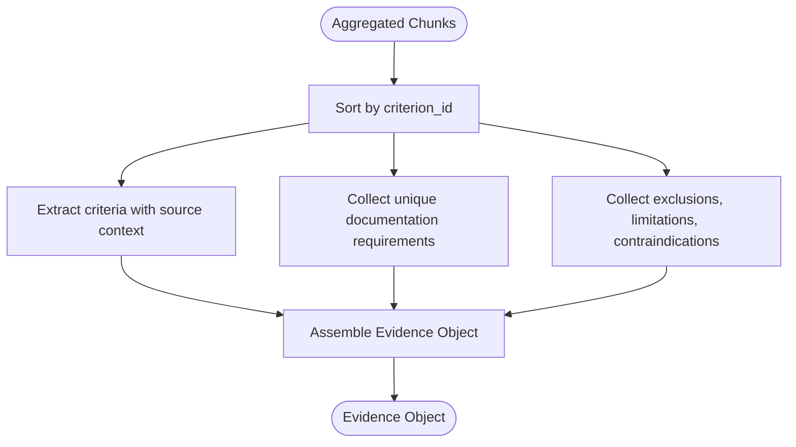
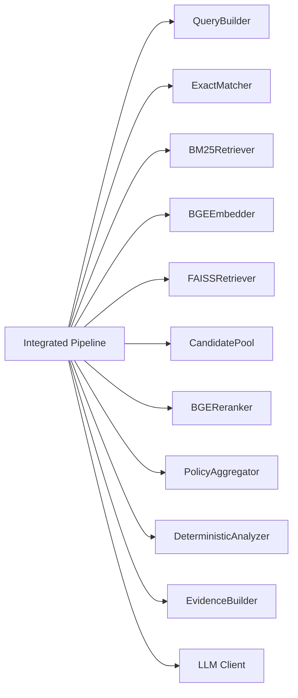

# RAG Pipeline

<cite>
**Referenced Files in This Document**
- [integrated_pipeline.py](file://services/integrated_pipeline.py)
- [config.yaml](file://config/config.yaml)
- [exact_matcher.py](file://rag/retrieval/exact_matcher.py)
- [bm25_retriever.py](file://rag/retrieval/bm25_retriever.py)
- [faiss_retriever.py](file://rag/retrieval/faiss_retriever.py)
- [bge_embedder.py](file://rag/embeddings/bge_embedder.py)
- [bge_reranker.py](file://rag/reranking/bge_reranker.py)
- [candidate_pool.py](file://rag/retrieval/candidate_pool.py)
- [policy_aggregator.py](file://rag/aggregation/policy_aggregator.py)
- [evidence_builder.py](file://rag/evidence/evidence_builder.py)
- [deterministic_analyzer.py](file://rag/analyzer/deterministic_analyzer.py)
- [query_builder.py](file://rag/query_builder/query_builder.py)
- [rag_models.py](file://models/rag_models.py)
- [test_contamination.py](file://tests/test_contamination.py)
</cite>

## Table of Contents
1. Introduction
2. Project Structure
3. Core Components
4. Architecture Overview
5. Detailed Component Analysis
6. Dependency Analysis
7. Performance Considerations
8. Troubleshooting Guide
9. Conclusion
10. Appendices

## Introduction
This document explains the Retrieval-Augmented Generation (RAG) pipeline used to match insurance claims against policy documents and produce grounded evidence for downstream decision-making. The system combines three retrieval strategies:
- Exact matching on structured fields (payer, policy ID, clinical domain, procedure codes, diagnosis codes)
- BM25 keyword search over tokenized text fields
- FAISS semantic similarity search using BGE embeddings

A policy consistency gate ensures that only a single policy is aggregated per claim, preventing cross-policy contamination. Retrieved chunks are analyzed deterministically to build structured clinical evidence, which is then used by an LLM to generate decisions with strict validation and recovery paths.

## Project Structure
The RAG pipeline is orchestrated by an integrated service that coordinates query building, three-way retrieval, candidate merging, reranking, policy aggregation, deterministic analysis, evidence construction, and LLM-based output generation. Configuration for models, device, and paths is centralized.

**Diagram sources**
- [integrated_pipeline.py:13-113](file://services/integrated_pipeline.py#L13-L113)
- [config.yaml:1-14](file://config/config.yaml#L1-L14)

**Section sources**
- [integrated_pipeline.py:13-113](file://services/integrated_pipeline.py#L13-L113)
- [config.yaml:1-14](file://config/config.yaml#L1-L14)

## Core Components
- Query Builder: Converts normalized claim inputs into structured, exact tokens, BM25 text, and semantic queries.
- Three-Way Retrievers:
  - ExactMatcher: Fast field-level overlap scoring with range support for CPT/ICD ranges.
  - BM25Retriever: Keyword-based ranking over indexed text fields; persisted via pickle.
  - FAISSRetriever: Semantic similarity search over BGE embeddings using inner product on normalized vectors; persisted as index + mapping.
- Candidate Pool: Merges results from all retrievers, deduplicates by chunk_id, and computes weighted combined scores.
- Reranker: BGE sequence classification reranker scores candidate pairs (query vs chunk representation).
- Policy Aggregator: Selects a single best policy and aggregates its chunks while enforcing payer and procedure compatibility (consistency gate).
- Deterministic Analyzer: Extracts criteria, documentation requirements, and exclusions without making coverage decisions.
- Evidence Builder: Assembles a structured evidence object grounded in analyzer output and source chunks.
- Integrated Pipeline: Orchestrates the end-to-end flow, including LLM prompting, validation, and safe fallbacks.

**Section sources**
- [query_builder.py:8-62](file://rag/query_builder/query_builder.py#L8-L62)
- [exact_matcher.py:37-120](file://rag/retrieval/exact_matcher.py#L37-L120)
- [bm25_retriever.py:20-111](file://rag/retrieval/bm25_retriever.py#L20-L111)
- [faiss_retriever.py:14-94](file://rag/retrieval/faiss_retriever.py#L14-L94)
- [candidate_pool.py:9-69](file://rag/retrieval/candidate_pool.py#L9-L69)
- [bge_reranker.py:94-146](file://rag/reranking/bge_reranker.py#L94-L146)
- [policy_aggregator.py:7-100](file://rag/aggregation/policy_aggregator.py#L7-L100)
- [deterministic_analyzer.py:7-80](file://rag/analyzer/deterministic_analyzer.py#L7-L80)
- [evidence_builder.py:7-33](file://rag/evidence/evidence_builder.py#L7-L33)
- [integrated_pipeline.py:13-113](file://services/integrated_pipeline.py#L13-L113)

## Architecture Overview
The pipeline executes a deterministic sequence: normalize input, build queries, retrieve via three methods, merge candidates, rerank, select a single policy, analyze chunks, build evidence, prompt LLM, validate output, and return a decision response. Failures are handled safely with human review escalation.

**Diagram sources**
- [integrated_pipeline.py:13-113](file://services/integrated_pipeline.py#L13-L113)
- [query_builder.py:8-62](file://rag/query_builder/query_builder.py#L8-L62)
- [exact_matcher.py:37-120](file://rag/retrieval/exact_matcher.py#L37-L120)
- [bm25_retriever.py:73-111](file://rag/retrieval/bm25_retriever.py#L73-L111)
- [faiss_retriever.py:69-94](file://rag/retrieval/faiss_retriever.py#L69-L94)
- [bge_embedder.py:122-131](file://rag/embeddings/bge_embedder.py#L122-L131)
- [candidate_pool.py:9-69](file://rag/retrieval/candidate_pool.py#L9-L69)
- [bge_reranker.py:94-146](file://rag/reranking/bge_reranker.py#L94-L146)
- [policy_aggregator.py:7-100](file://rag/aggregation/policy_aggregator.py#L7-L100)
- [deterministic_analyzer.py:7-80](file://rag/analyzer/deterministic_analyzer.py#L7-L80)
- [evidence_builder.py:7-33](file://rag/evidence/evidence_builder.py#L7-L33)

## Detailed Component Analysis

### Three-Way Retrieval System
- Exact Matching: Scores chunks based on payer substring match, exact policy ID match, clinical domain equality, procedure code exact or range inclusion, and diagnosis code exact or range inclusion. Normalizes score relative to available fields.
- BM25 Keyword Search: Builds a tokenized corpus from payer, section, criterion name, procedure codes, diagnosis codes, and full text. Returns normalized scores mapped back to chunk metadata.
- FAISS Semantic Search: Uses BGE embeddings (L2-normalized CLS pooling) and Inner Product similarity. Supports saving/loading index and metadata mapping.

**Diagram sources**
- [query_builder.py:8-62](file://rag/query_builder/query_builder.py#L8-L62)
- [exact_matcher.py:37-120](file://rag/retrieval/exact_matcher.py#L37-L120)
- [bm25_retriever.py:73-111](file://rag/retrieval/bm25_retriever.py#L73-L111)
- [faiss_retriever.py:69-94](file://rag/retrieval/faiss_retriever.py#L69-L94)
- [bge_embedder.py:122-131](file://rag/embeddings/bge_embedder.py#L122-L131)
- [candidate_pool.py:9-69](file://rag/retrieval/candidate_pool.py#L9-L69)
- [bge_reranker.py:94-146](file://rag/reranking/bge_reranker.py#L94-L146)

**Section sources**
- [exact_matcher.py:37-120](file://rag/retrieval/exact_matcher.py#L37-L120)
- [bm25_retriever.py:20-111](file://rag/retrieval/bm25_retriever.py#L20-L111)
- [faiss_retriever.py:14-94](file://rag/retrieval/faiss_retriever.py#L14-L94)
- [bge_embedder.py:21-131](file://rag/embeddings/bge_embedder.py#L21-L131)
- [bge_reranker.py:27-146](file://rag/reranking/bge_reranker.py#L27-L146)

### Policy Consistency Gate and Single-Policy Aggregation
- Enforces payer compatibility and mandatory procedure compatibility before selecting a policy.
- If a claim includes a requested policy ID, only that policy may be chosen; otherwise, selects the best-scoring compatible policy with specificity boosts for titles and exact procedure matches.
- Aggregates all chunks belonging to the selected policy to prevent cross-policy contamination.

**Diagram sources**
- [policy_aggregator.py:7-100](file://rag/aggregation/policy_aggregator.py#L7-L100)
- [policy_aggregator.py:102-160](file://rag/aggregation/policy_aggregator.py#L102-L160)

**Section sources**
- [policy_aggregator.py:7-100](file://rag/aggregation/policy_aggregator.py#L7-L100)
- [policy_aggregator.py:102-160](file://rag/aggregation/policy_aggregator.py#L102-L160)
- [test_contamination.py:5-32](file://tests/test_contamination.py#L5-L32)

### Evidence Building Process
- Deterministic Analyzer extracts criteria, documentation requirements, and exclusions from aggregated chunks without making coverage decisions.
- Evidence Builder constructs a structured evidence object containing policy_id, payer, criteria, documentation requirements, exclusions, and grounded source chunks.

**Diagram sources**
- [deterministic_analyzer.py:7-80](file://rag/analyzer/deterministic_analyzer.py#L7-L80)
- [evidence_builder.py:7-33](file://rag/evidence/evidence_builder.py#L7-L33)

**Section sources**
- [deterministic_analyzer.py:7-80](file://rag/analyzer/deterministic_analyzer.py#L7-L80)
- [evidence_builder.py:7-33](file://rag/evidence/evidence_builder.py#L7-L33)

### Implementation Details

#### Embedding Generation
- BGE Embedder uses lazy loading of tokenizer and model, streaming safetensors weights directly into RAM to avoid memory-mapping issues on Windows.
- Embeddings are L2-normalized CLS-pooled vectors suitable for cosine similarity via inner product.
- Supports embedding single queries or batches, with optional query instruction prefix.

**Section sources**
- [bge_embedder.py:21-131](file://rag/embeddings/bge_embedder.py#L21-L131)

#### Vector Similarity Search
- FAISSRetriever builds an IndexFlatIP index for normalized embeddings and maps vector indices to chunk metadata.
- Supports save/load of index and mapping files for reuse across runs.

**Section sources**
- [faiss_retriever.py:14-94](file://rag/retrieval/faiss_retriever.py#L14-L94)

#### Candidate Pool Merging
- Merges exact, FAISS, and BM25 results, deduplicating by chunk_id and tracking sources.
- Computes weighted combined score using configurable weights and returns top candidates.

**Section sources**
- [candidate_pool.py:9-69](file://rag/retrieval/candidate_pool.py#L9-L69)

#### Reranking Strategies
- BGEReranker constructs pair representations (query vs chunk summary) and predicts logits converted to probabilities via sigmoid.
- Updates candidates with rerank_score and sorts descending.

**Section sources**
- [bge_reranker.py:27-146](file://rag/reranking/bge_reranker.py#L27-L146)

### Configuration Options
- Models: embedding_model and reranker_model names.
- Retrieval parameters: candidate_pool_size controls top_k for FAISS/BM25; final_policy_chunk_count can limit downstream processing.
- Device: CPU/GPU selection for inference.
- Paths: locations for models cache, embeddings, vector store, raw/normalized/processed data.

**Section sources**
- [config.yaml:1-14](file://config/config.yaml#L1-L14)

### Customization Examples

- Customize retrieval strategies:
  - Adjust CandidatePool weights to emphasize exact matching or semantic search.
  - Tune BM25 tokenization or include additional fields in indexing.
  - Modify FAISS dimension or switch to different index types if needed.

- Extend the evidence builder:
  - Add new fields to the evidence object to capture additional policy constraints or metadata.
  - Integrate custom analyzers to enrich criteria extraction.

- Integrate new embedding models:
  - Replace BGEEmbedder with another model provider while maintaining normalized outputs and interface contracts.
  - Ensure FAISS index dimensions match the new embedding size.

[No sources needed since this section provides general guidance]

## Dependency Analysis
The integrated pipeline depends on multiple components that must be provided via a components dictionary. Key dependencies include query builder, retrievers, embedder, reranker, aggregator, analyzer, evidence builder, and LLM client.

**Diagram sources**
- [integrated_pipeline.py:13-113](file://services/integrated_pipeline.py#L13-L113)

**Section sources**
- [integrated_pipeline.py:13-113](file://services/integrated_pipeline.py#L13-L113)

## Performance Considerations
- Model Loading: Both BGEEmbedder and BGEReranker use lazy loading and stream weights to minimize memory overhead and avoid platform-specific memory-mapping failures.
- Index Persistence: BM25 and FAISS indexes are saved and loaded to reduce rebuild time and memory usage during repeated queries.
- Batch Processing: Embedding supports batched texts to improve throughput.
- Candidate Pool Size: Configurable top_k balances recall and performance; larger pools increase reranking cost.
- Device Selection: Use GPU when available to accelerate embedding and reranking; otherwise CPU is supported.

[No sources needed since this section provides general guidance]

## Troubleshooting Guide
- Missing Indexes: BM25 and FAISS retrievers raise errors if indexes are not built or loaded; ensure indexes exist at configured paths.
- Dimension Mismatch: FAISS expects embeddings of a specific dimension; verify embedding model configuration matches index dimension.
- Empty Results: BM25 returns empty if tokenization yields no tokens; check query text preprocessing.
- Policy Compatibility: PolicyAggregator enforces payer and procedure compatibility; ensure query_proc and payer are correctly normalized.
- Safe Fallbacks: Integrated pipeline catches exceptions and escalates to HUMAN_REVIEW to prevent incorrect decisions.

**Section sources**
- [bm25_retriever.py:63-71](file://rag/retrieval/bm25_retriever.py#L63-L71)
- [faiss_retriever.py:59-67](file://rag/retrieval/faiss_retriever.py#L59-L67)
- [policy_aggregator.py:102-123](file://rag/aggregation/policy_aggregator.py#L102-L123)
- [integrated_pipeline.py:114-117](file://services/integrated_pipeline.py#L114-L117)
- [integrated_pipeline.py:240-253](file://services/integrated_pipeline.py#L240-L253)

## Conclusion
The RAG pipeline integrates exact, keyword, and semantic retrieval to robustly identify relevant policy content, enforces a strict policy consistency gate to prevent cross-policy contamination, and constructs grounded evidence for reliable decision-making. With configurable models, tunable retrieval parameters, and safe failure modes, it scales to large policy datasets while maintaining accuracy and operational safety.

[No sources needed since this section summarizes without analyzing specific files]

## Appendices

### Data Models
- ClaimInput and related schemas define the normalized input contract for the pipeline.
- Chunk schema defines fields used by retrievers and aggregators.

**Section sources**
- [rag_models.py:8-57](file://models/rag_models.py#L8-L57)
- [rag_models.py:63-87](file://models/rag_models.py#L63-L87)