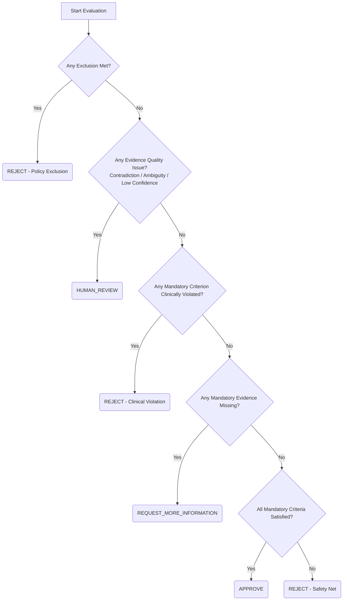

# Deterministic Decision Agent for Clinical Cases

A standalone, highly modular, strongly typed, and entirely deterministic decision engine for clinical/claim cases. It evaluates patient case data against policy criteria, exclusions, and evidence quality rules to produce a definitive outcome determination: `APPROVE`, `REJECT`, `REQUEST_MORE_INFORMATION`, or `HUMAN_REVIEW`.

---

## 1. Project Architecture

The codebase separates concerns across data models/schemas, rule checking, evidence validation, and decision compiling:

```text
decision_agent/
├── __init__.py           # Exposes the public API of the package
├── schemas.py           # Strongly-typed schemas (Pydantic v2) for CaseData, Policy, Evidence, etc.
├── policy_evaluator.py   # Deterministic evaluation of policy exclusions and clinical criteria rules
├── evidence_evaluator.py # Evidence verification (quality check, confidence, and fact analysis)
├── decision_logic.py     # Aggregates evaluation results and applies the decision hierarchy
└── agent.py              # Main orchestrator agent wrapper class
```

---

## 2. Key Components

### Canonical claim + RAG policy contract

`DecisionAgent.evaluate_canonical_claim(canonical_claim, rag_policy)` accepts only a
canonical claim JSON object and a RAG policy JSON object. Its optional LLM step returns
strict, per-criterion assessments with canonical JSON evidence paths; it cannot return
or override a final decision. Invalid criterion IDs, duplicate/missing assessments,
unknown canonical paths, malformed JSON, or schema-invalid output fail closed to
`HUMAN_REVIEW`. The deterministic policy, evidence, and decision hierarchy remain the
sole final-decision authority. The older raw-evidence extraction path is retained for
migration compatibility.

The criterion-reasoning flow submits the canonical claim and one RAG criterion per LLM
request. `interpretation_guidance`, `required_evidence`, and `evaluation_type` are
carried on `PolicyCriterion`; required evidence is normalized into the existing
deterministic evidence-key contract. Assessment safety states are translated to existing
evidence quality signals, while only canonical facts can satisfy or violate a rule.

### 2.1 Schemas (`schemas.py`)
Provides input and output schemas backed by **Pydantic (v2)** to ensure strict verification of typings:
- **`CaseData`**: Patient's age, diagnoses codes, procedures, and arbitrary clinical metrics.
- **`Policy`**: Exclusions (`PolicyExclusion`) and core eligibility criteria (`PolicyCriterion`).
- **`EvidenceItem`**: Pieces of evidence provided for verification. Each has a status (`verified`, `unverified`, `contradictory`), confidence score, ambiguity flag, and `extracted_facts`.
- **`DecisionResponse`**: Output structure containing the final `DecisionOutcome`, step-by-step audit trace reasoning, and diagnostic maps detailing why each component checked out or failed.

### 2.2 Operator Rule Engine (`policy_evaluator.py`)
Determines whether fields meet specific conditions (like `patient_age > 85` or `diagnoses contains E10`). 
- **Nested Fields**: Supports dotted paths (e.g. `clinical_metrics.HbA1c`).
- **Operators**: Supports: `eq`, `ne`, `lt`, `lte`, `gt`, `gte`, `contains`, `not_contains`, `in`, `not_in`.
- **Advanced Lists Matching**: Suffix/Prefix-friendly list containing checks, making it highly robust for matching ICD codes (e.g. looking for prefix `E10` clinical codes inside patient's code array `["E10.9"]`).

### 2.3 Evidence Evaluator (`evidence_evaluator.py`)
Verifies metadata quality and corroborating facts:
- **Confidence Checker**: Flags items missing the confidence threshold (default 0.70).
- **Ambiguity/Contradiction Checker**: Flags `is_ambiguous` or `contradictory` claims.
- **Extract Fact Checker**: Automatically runs validation rules against parsed evidence values (e.g., matching the verified lab report's value `hba1c > 8.0`).

### 2.4 Decision compiler (`decision_logic.py`)
Applies the following decision resolution hierarchy:



---

## 3. Getting Started

### 3.1 Setup
Ensure Python 3.13+ is installed, then create and activate a virtual environment. Install dependencies:
```bash
pip install -r requirements.txt
```

### 3.2 Running Tests
Execute the unit tests using `pytest`:
```bash
pytest
```
All tests cover full state-transition mappings, operator checks, field resolution, and edge cases.
